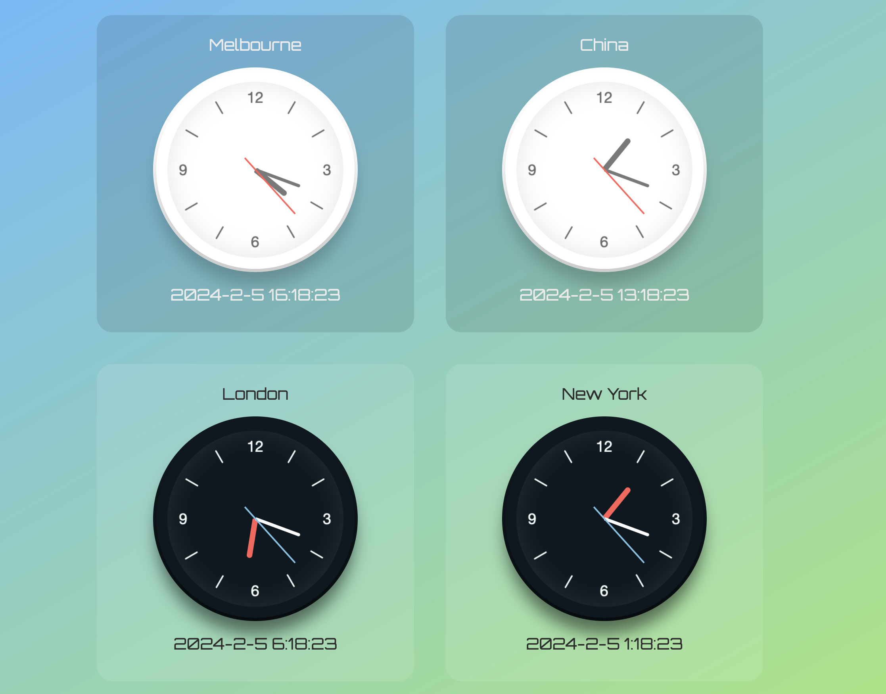

# World-Clock-Website

Using the React + Vite technology stack to create a front-end dynamic page that
Showing clocks from four different regions: Melbourne, China, London, and New York.

[https://iridescent-gaufre-dce53f.netlify.app](https://iridescent-gaufre-dce53f.netlify.app/)

<!-- PROJECT SHIELDS -->

[![LinkedIn][linkedin-shield]][www.linkedin.com/in/haonan-tao-aaron]

<!-- PROJECT LOGO -->
<br />



</p>


## Content

- [Basic Develop environment](#Basic Develop environment)
  - [Set Up](#Set Up)
- [Files Catalog Contents](#Files Catalog Contents)
- [How to Use](#How to Use)
- [Deployment](#Deployment)
- [Skills](#Skills)
- [Contributor](#Contributor)
  - [Open Source](#Open Source)
- [Version Control](#Version Control)
- [Author](#Author)
- [External Links](#External Links)

### Basic Develop environment


###### **Set Up **

Clone the repo

```sh
git clone https://github.com/HAONANTAO/World-Clock.git
```


### Files Catalog ContentsFiles Catalog Contents


```
filetree 
├── README.md
├── yarn.lock
├── vite.config.js
├── package.json
├── LICENSE
├── index.html
├── .gitignore
├── .eslintrc.cjs
├── public

├── src
│  ├── backup
│  │  ├── ClockGroup.jsx
│  │  ├── PointerCenter.jsx
│  ├── components
│  │  └── BasicPointer.jsx
│  │  ├── City.jsx
│  │  └── Clock.jsx
│  │  ├── Pointer.jsx
│  │  ├── Time.jsx
│  ├── App.css
│  ├── App.jsx
│  ├── index.css
│  ├── main.jsx
│  ├── images
│  │  ├── clock_black.png
│  │  ├── clock_white.png


```

**How to Use**

```
yarn
```

```
yarn dev
```


### Deployment

Use the NetLify

### Skills

- HTML

- CSS

- JavaScript

- React

- "react-dom"

- "styled-components"

- "Vite"

- "click-to-react-component"

  

### Contributor

HAONAN TAO


#### Open Source

Contributing makes the open-source community a great place to learn, inspire and create. Any contribution you make is **very much appreciated**.


1. Fork the Project
2. Create your Feature Branch 
3. Commit your Changes 
4. Push to the Branch 
5. Open a Pull Request


### Version Control

The project uses Git for versioning.


### Author

HAONANTA0


### External Links


